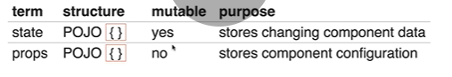

# React State

Two types of state:

- UI L
  ogic - the changing state of the interface ej, opening a modal

- Bussiness logic - the changing state of data e
j, the inbox, messages (read or unread). 

State is an instance atribute on a component. its always an object (POJO)

si tu componente no tiene estado, no necesit un constructor function

si tu componente si tiene estado, 

    constructor(props) {
      super(props);
      this.state = {
        /*values we wnt to track*/
      };
    }

- constructor takes on argument, props

- you must call super(props at star , registers your class as a react component). super is a reference to the constructor component
- inside of the instance methods you can refer this.stare like this.props

        class Game extends Component {
          constructor(props) {
              super(props);
              this.state = {
                player: 'Whiskey',
                score: 0 
              };
            }
            render(){
              return {
                

                <h1>Battleship</h1>
                
Current Player: {this.state.player}

                
Score: {this.state.score}

                

              }
            }
        }

A diferencia de las props, cuando usas state es necesario inicializarlo

### Alternative syntax

Using babel you can also ommit the constructor part 

    class Game extends Component {
                  state = {
                    player: 'Whiskey',
                    score: 0 
                  };
                }

But its not real js, solo puede ser usado con Creac-react-app a menos de que lo preconfigures
 
### super() vs super(props)

Si no necesitas utilizar las props dentro del constructor no es necesario pasarlas como parametro, aunque es recomendado como estandar

### setting the state

NUNCA se debe manipular directamente, ej

    this.state.score = 0;

Para eso se debe usar el metodo this.stateState() pero no en el constructor y tampoco en render. Solo se inicializa el state en constructor

    this.setsState({.score = 0})

Se actualiza de manera asincrona. Se pueden pasar objetos y funciones

- Es una request, no una orden para cambiar el estado inmediatamente

### Click events in React

Necesitan asociar la funcion con la instancia del componente en si. Para eso puedes utilizar:

- bind() en el constructor

 > La mas recomendada

        this.handleClick = this.handelClick.blind(this);

- Class propperties

        handleClick = () => {
          console.log('click);
        }

        render(){
               return {
                  <button onClick={this.handleClick}>
                        Click me
                  </button>
                }
        }

- Bind in render

        render(){
               return {
                  <button onClick={this.handleClick.bind(this)}>
                        Click me
                  </button>
                }
        }

- Arrow function in render

        render(){
            return {
                <button onClick={() => this.handleClick()}>Click me</button>
            }
        }

- Alternative syntax

        class Game extends Component {
              state = { clicked: false };
        }

        handleClick = (e) => {
                  this.setState({ clicke: true});
                }

        render(){
               return {
                  <button onClick={this.handleClick}>
                        Click me
                  </button>
                }
        }

### State as props

a common pattern is to use a stateful(smart) parent component passing down its state values as props to stateless(dumb) child components

 ---
- CUAL ES LA DIFERENCIA ENTRE STATE Y PROPS?

- como saber cuando usar cual?
- son las props de vue inmutables tambien?
- hay un equivalente en vue de los states de react?
- diferencia entre instance y class
